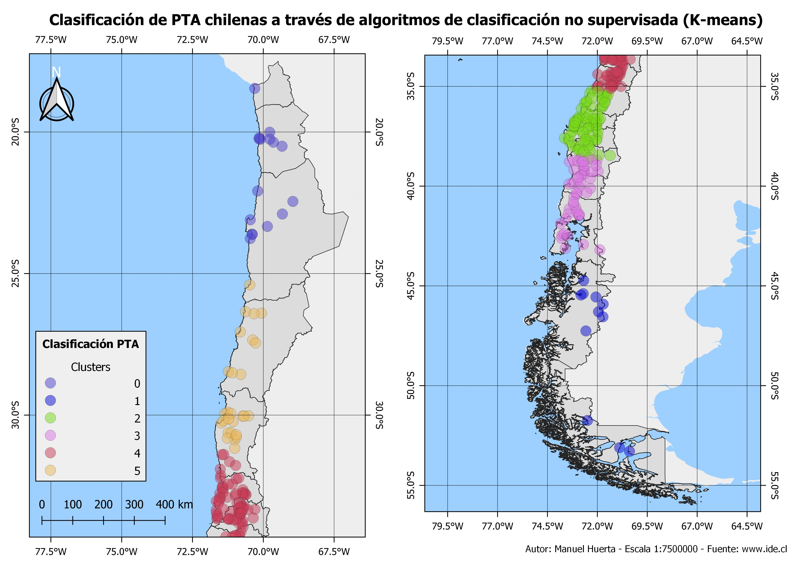

# 30DayMapChallenge

Hola!

Estaré aquí subiendo los mapas correspondientes al desafío de [tjukanovt](https://github.com/tjukanovt/30DayMapChallenge) #30DayMapChallenge, si desean ver toda la información este es el [link](https://drive.google.com/drive/folders/1ECTE8wcxsj2rFyp0f8pB7K5HojM3LL0p?usp=sharing) de google drive.

Por otro lado, los mapas que he ido realizando son los siguientes:

  
  
  
  
  
  
  
  
  

